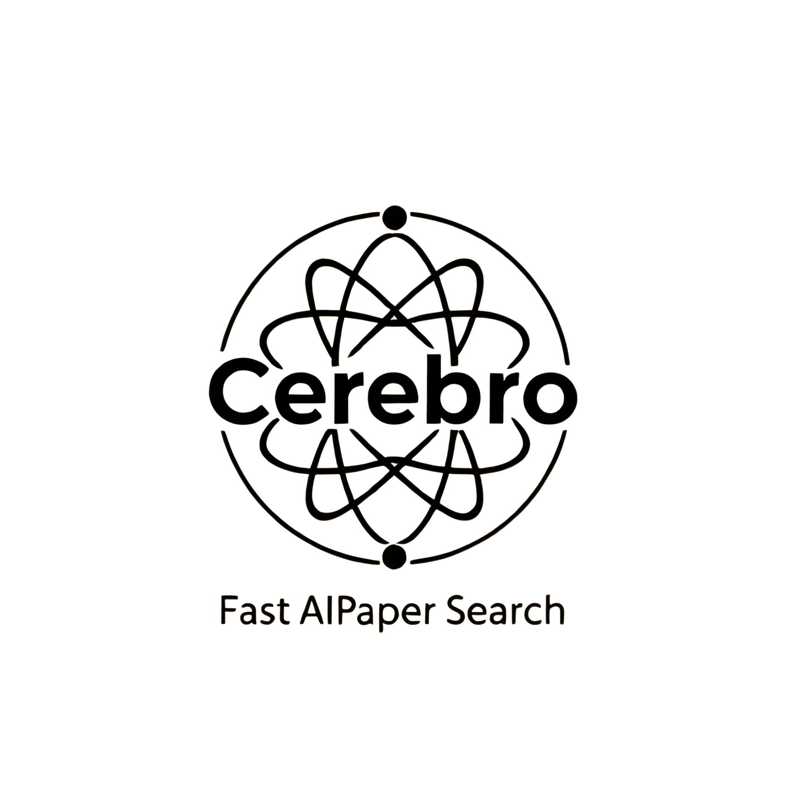

# Cerebro - AI Conference Paper Search Engine 

<p align="center">
  
</p>

Cerebro is a modern, streamlined search engine for discovering and exploring papers from major AI/ML conferences. Built with Streamlit, it provides real-time paper aggregation and efficient search capabilities across venues like NeurIPS, ICML, ICLR, and the ACL Anthology.

Live - https://cerebro-search.streamlit.app/ 

## ✨ New Features & Improvements

- **Smart Database Management**: 
  - One-time initialization of paper database
  - Efficient paper fetching with progress tracking
  - Background updates for new papers
  - Fast search response times
  
- **Makefile Support**:
  ```bash
  make clean     # Remove existing database
  make init      # Initialize fresh database
  make run      # Start Streamlit app
  make all      # Complete reset and startup
  ```

- **Enhanced Search**:
  - Full-text search across titles and abstracts
  - Filter by exact conference venues
  - Year-based filtering
  - Real-time paper count display

## 🎯 Core Features

- **Paper Aggregation**: Fetches papers from major AI conferences
- **Conference Coverage**:
  - **ML Conferences**: NeurIPS, ICML, ICLR
  - **ACL Venues**: ACL, EMNLP, NAACL, EACL, CoNLL, and more
- **Paper Details**:
  - Title and authors
  - Conference venue and year
  - Direct paper links
  - Expandable abstracts
- **Modern UI**:
  - Responsive layout
  - Clean paper display
  - Pagination controls
  - Smooth transitions

## 🚀 Installation

1. Clone the repository:
```bash
git clone https://github.com/yourusername/cerebro.git
cd cerebro
```

2. Install dependencies:
```bash
pip install -r requirements.txt
```

3. Initialize and run:
```bash
make all    # Complete setup and launch
# OR
make init   # Just initialize database
make run    # Just run the application
```

## 💡 Usage

1. Search across all papers using the search bar
2. Filter by conference venue and year
3. View paper abstracts with one click
4. Navigate results with pagination controls

## 🏗️ Architecture

- `app.py`: Main Streamlit application
- `config.py`: Configuration settings
- `utils.py`: Helper functions
- `db/`: 
  - `paper_db.py`: Database management and search
- `parsers/`:
  - `base.py`: Base parser class
  - `acl_parser.py`: ACL Anthology parser
  - `ml_parser.py`: ML conference parser

## 🤝 Contributing

Contributions welcome! Feel free to submit a Pull Request.

## 📝 License

MIT License - see LICENSE file for details.
